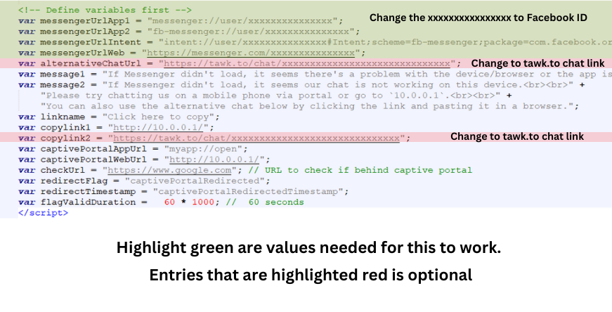

## Auto Redirect Captive Portal + Redirect Messenger `(w/ backup chat)`

  

    <iframe src="https://www.youtube.com/embed/vllGGkFhSF4?autoplay=1&mute=1&vq=hd1080" frameborder="0" allow="accelerometer; autoplay; encrypted-media; gyroscope; picture-in-picture" allowfullscreen></iframe>
  

  

    <iframe src="https://www.youtube.com/embed/w9SFjzVCnEo?autoplay=1&mute=1&vq=hd1080" frameborder="0" allow="accelerometer; autoplay; encrypted-media; gyroscope; picture-in-picture" allowfullscreen></iframe>
  

---

## DOWNLOADS
<!--
### Latest Version `(password at the bottom)`

|| <a href="https://raw.githubusercontent.com/RMBDon/JuanfiMessengerChat/main/Bypass captive portal with clear voucher.zip" download>Bypass captive portal w/ Clear Voucher</a> || 

|| <a href="https://raw.githubusercontent.com/RMBDon/JuanfiMessengerChat/main/clear voucher only.zip" download>Clear Voucher Only</a> || 

|| <a href="https://raw.githubusercontent.com/RMBDon/JuanfiMessengerChat/main/Bypass captive portal with Messenger with Clear Voucher.zip" download>Bypass captive portal with Messenger with Clear Voucher</a> ||

|| <a href="https://raw.githubusercontent.com/RMBDon/JuanfiMessengerChat/main/Bypass captive portal with Messenger.zip" download>Bypass captive portal with Messenger</a> ||

### Old Versions `(password at the bottom)`

|| <a href="https://raw.githubusercontent.com/RMBDon/JuanfiMessengerChat/main/Old_versions.zip" download>Old Versions</a> ||

### Others `(password at the bottom)`

|| <a href="https://raw.githubusercontent.com/RMBDon/JuanfiMessengerChat/main/loyalty.zip" download>Fixed Unliloop Loyalty Page</a> ||

-->

---

### Requirements

   - tawk.to account `(Recommended for backup chat, failover)`
        
   - Group Page chat ID or Personal FB Account username `(or ID)` . `Google niyo na lang pano kunin :)`

---

### Notice!

   - enabling Messenger chat requires you to bypass messenger on walled garden `(but with limited access, just enough for chat and send images)`

---

## Instructions

   1. Pick and download `(login.html & status.html)` options that you want `(Redirect portal only, Redirect portal + Messenger Chat)`

   2. Once downloaded, Open the login.html and change the needed values shown below. `(Ignore if Redirect Portal only)`

   3. Do the same with the status.html . Tip : just copy the settings from login.html `(Ignore if Redirect Portal only)`

   4. Once finished, replace it with the existing files at `/hotspot/` or `/flash/hotspot/`

   5. Copy and paste this to you mikrotik terminal.
         
    /ip hotspot walled-garden
    add dst-host=*facebook.com action=allow comment="fb messenger bypass"
    add dst-host=*connect.facebook.net action=allow comment="fb messenger bypass"
    add dst-host=*messenger.com action=allow comment="fb messenger bypass"
    add dst-host=*m.me action=allow comment="fb messenger bypass"
    add dst-host=*fna.fbcdn.net action=deny comment="fb messenger bypass"

   6. Test and deploy.

---

## If nagustuhan nyo boss, pangkape lang 🤣☕️ `09760049167` 

---

## Maraming Salamat!

---

### zip password - `lazy4692`

---

#### Other files that you might like

<a href="https://rmbdon.github.io/Lazy-Portal-v7-RMTheme-2/"> Lazy v7 - Adjustable Theme v2</a>

---

#### Also available customized Mikrotik Scripts . Need remote `(not 1 click install 😅)` depende if available ang time.

  - Failover Telegram Notification

    - Error Handling during Telegram outage `(saved to backup in txt form)`

  - Accurate Monthly/Yearly Script Reset

    - Exact day of the month reset `(not 30days)`

  - Auto reboot (based on # operating hours and user count)

  - Modify onlogin/ onlogout script

  - Modified Telegram Notifications

    - Add system variables

    - Change Format

    - Notify node or interface down

    - Notify internet is down

  - Others
